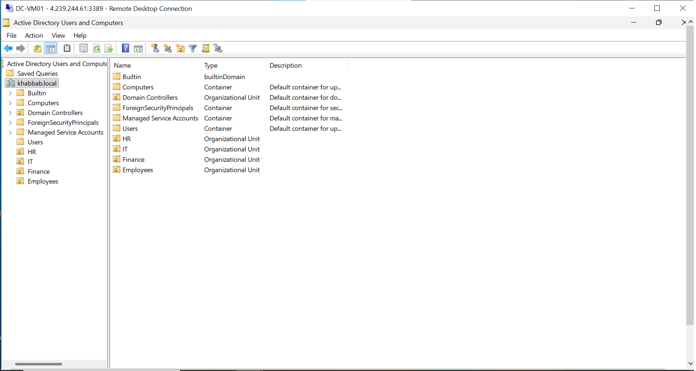
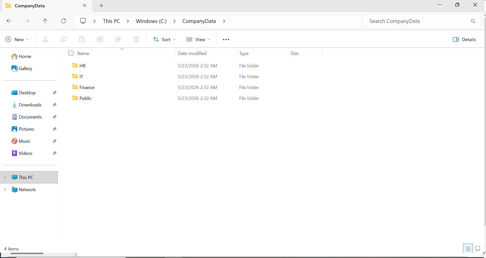
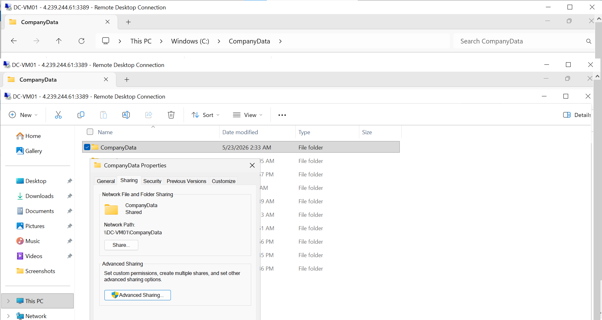
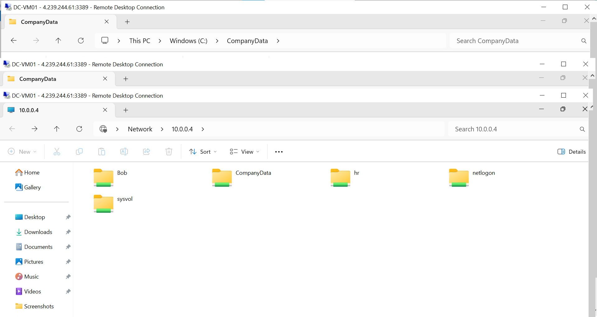
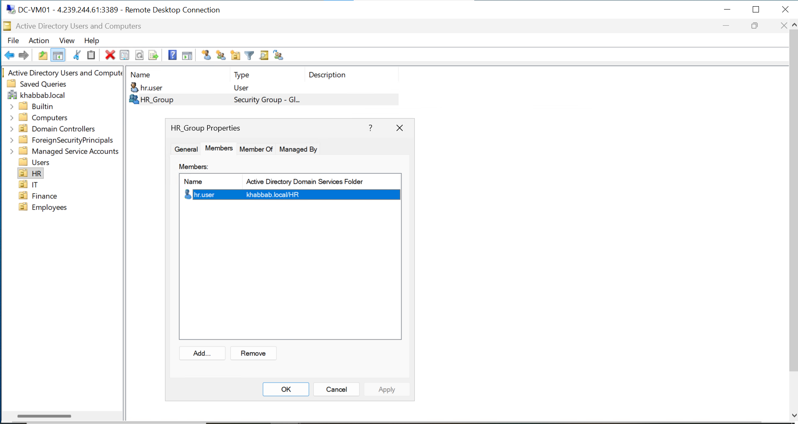
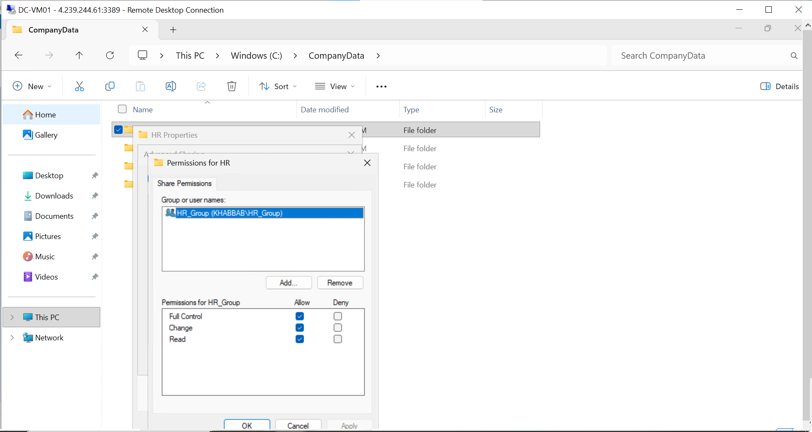
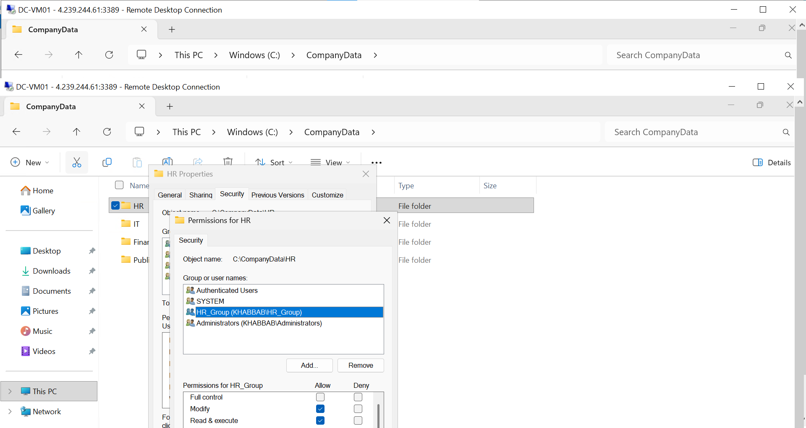
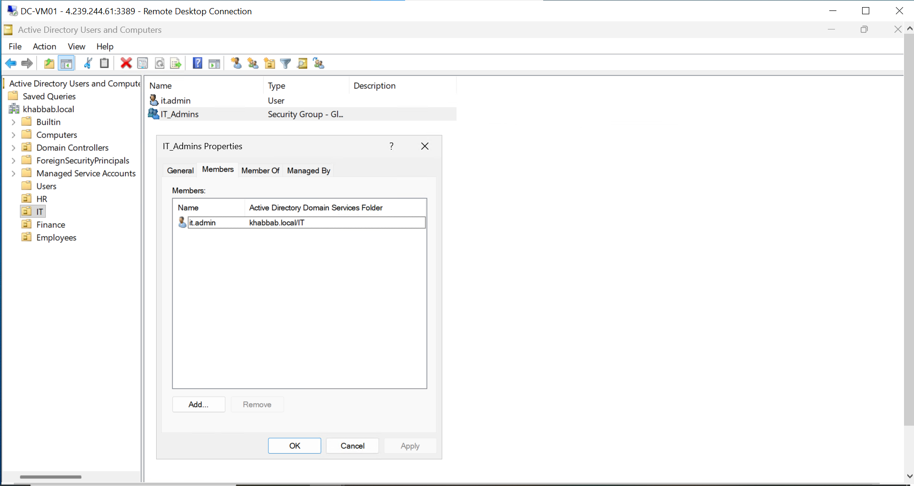

# Enterprise Windows Server Infrastructure Lab

Enterprise-style Windows Server infrastructure project built using Active Directory Domain Services (AD DS), SMB File Sharing, NTFS Permissions, Organizational Units, Group Policy, and Domain Administration.

This hands-on lab simulates a real-world enterprise environment with centralized identity management, departmental access control, shared network resources, and Windows Server administration.

---

# Technologies Used

* Windows Server 2025
* Active Directory Domain Services (AD DS)
* Organizational Units (OUs)
* Group Policy (GPO)
* DNS
* SMB File Sharing
* NTFS Permissions
* Windows Administration
* User & Group Management
* Remote Desktop Protocol (RDP)
* Enterprise Network Shares

---

# Infrastructure Components

## Active Directory Domain Services

* Installed and configured AD DS
* Promoted Windows Server to Domain Controller
* Configured domain environment
* Managed domain users and computers

## Organizational Units (OUs)

* Created enterprise OU structure
* Organized departments and administrative containers
* Managed user placement and delegation

## Group Policy Management

* Configured and applied GPOs
* Managed domain policies
* Tested policy deployment across domain systems

## Enterprise SMB File Sharing

* Created shared network folders
* Configured CompanyData shared directory
* Implemented department-based file access
* Validated SMB connectivity across domain clients

## NTFS Permissions & Access Control

* Configured NTFS permissions
* Implemented HR department access restrictions
* Managed security groups for enterprise access control

## Domain Administration

* Managed users, computers, and groups
* Validated domain logins
* Tested client-to-server communication
* Configured enterprise administrative access

---

# Lab Tasks Performed

* Installed Windows Server
* Configured Active Directory Domain Services
* Promoted server to Domain Controller
* Created Organizational Units (OUs)
* Created domain users and security groups
* Configured DNS services
* Applied Group Policies
* Created SMB network shares
* Configured NTFS permissions
* Tested domain authentication
* Validated enterprise file sharing access
* Managed administrative permissions

---

# Screenshots

## Active Directory Organizational Units

## Domain Controller Overview

## Domain Users

## Security Groups

## Group Policy Management

## Enterprise Folder Structure

## CompanyData Network Share

## Enterprise SMB File Sharing Validation

## HR Group Membership

## HR Share Permissions

## HR NTFS Permissions

## IT Admin Group Membership

---

# Author

Khabbab Mujtaba Abdallah
IT Support Engineer | Windows Server | Azure | Networking | Cloud & DevOps

LinkedIn:
https://www.linkedin.com/in/khabbabmujtaba
