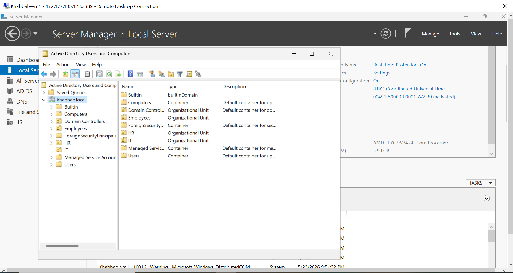
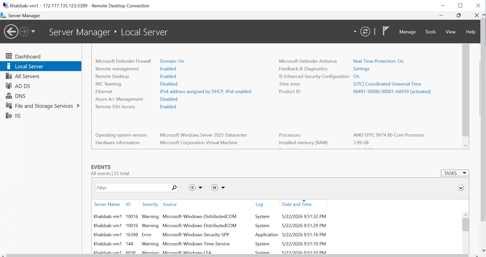
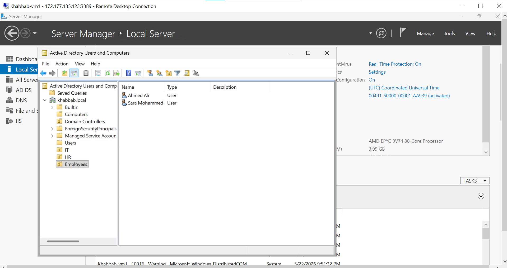
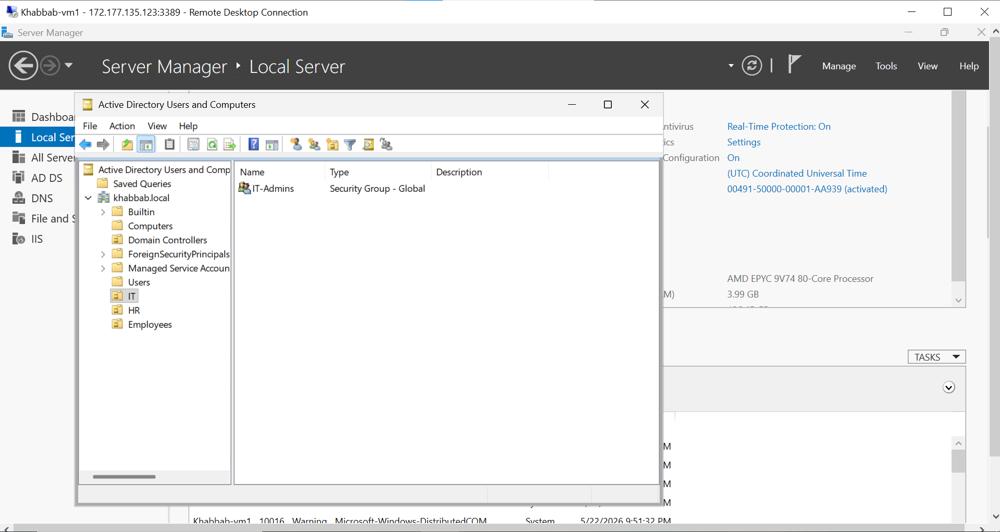
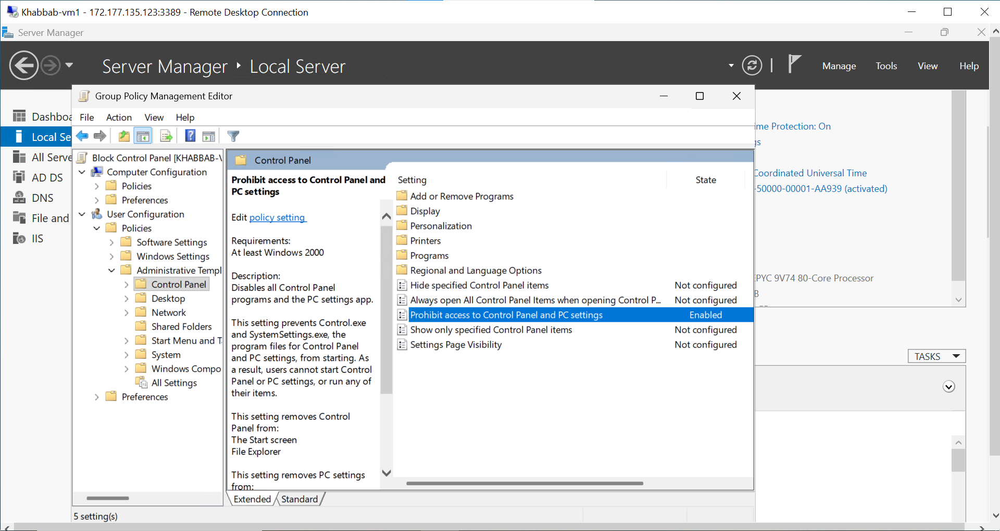

# Windows Server Active Directory Lab

Enterprise-style Windows Server infrastructure lab built on Active Directory domain services and administrative management.

Hands-on Windows Server lab focused on Active Directory Domain Services (AD DS), user and group management, organizational units, DNS configuration, and Group Policy administration.

---

## Technologies Used

* Windows Server
* Active Directory Domain Services (AD DS)
* Group Policy (GPO)
* DNS
* DHCP
* Remote Desktop Protocol (RDP)
* User and Group Management
* Windows Administration

---

## Lab Tasks

* Installed and configured Active Directory
* Promoted server to Domain Controller
* Created domain users and groups
* Configured Organizational Units (OUs)
* Applied Group Policies (GPO)
* Configured DNS services
* Tested domain login and permissions
* Managed users and administrative access

---

## Screenshots

### Active Directory Structure

### Domain Controller Overview

### Domain Users

### Security Groups

### Group Policy Management

---

## Author

Khabbab Mujtaba Abdallah
IT Support Engineer | Azure | Windows Server | Networking | Cloud & DevOps
